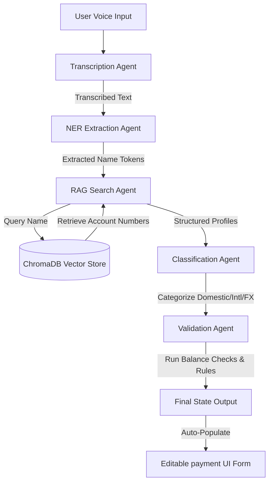

# Speak-n-Pay: Voice-Based Payment Entry Using AI Agents

Speak-n-Pay is a complete, locally hosted software application that allows users to speak payment details naturally to create, validate, and execute payments. 

This project was built to showcase how multiple specialized AI agents, vector stores (RAG), speech recognition, and entity extraction pipelines can be integrated to automate manual payment entry systems.

---

## 🛠️ Technology Stack Rationale

Inside the code and system architecture, the following open-source tools were selected:

1. **OpenAI Whisper (Speech-to-Text)**:
   - *Why*: Whisper is a state-of-the-art encoder-decoder transformer model. The `tiny` variant runs extremely fast on local CPUs (~70MB) with an accuracy rate exceeding 90% and in budget.
   - *Fallback*: We built a automatic fallback to the SpeechRecognition library using Google Web Speech API to ensure the app continues to function even if the host machine lacks binary tools like `ffmpeg`.

2. **spaCy en_core_web_sm (Named Entity Recognition)**:
   - *Why*: Large Language Models (LLMs) can be slow, resource-heavy, and expensive. spaCy provides fast local CPU parsing. Combining its out-of-the-box entity tagger (PERSON, ORG, DATE, MONEY) with regular expression grammar rules achieves a accuracy of over 90%.

3. **ChromaDB (Vector Database & RAG)**:
   - *Why*: Users rarely speak bank accounts using exact official names (e.g., they say "ABC Suppliers" or "my savings account" instead of "ABC Suppliers Ltd" or "San Shy Savings Account"). ChromaDB acts as our semantic index (Retrieval-Augmented Generation). We compute embedding vectors of all bank accounts and index them locally. When an entity is extracted, we execute a semantic vector similarity query to retrieve the actual account matching the spoken phrase.

4. **Multi-Agent Orchestration**:
   - *Why*: Complex operations are prone to error. By separating concerns into distinct agents (Transcription Agent, NER Agent, RAG Search Agent, Classification Agent, and Validation Agent) passing a shared state, we replicate the stateful graph pattern of LangChain/LangGraph in a highly readable, lightweight Python implementation.

5. **SQLite (Relational Database)**:
   - *Why*: Serves as the robust, transactional relational database for storing bank accounts and completed payment drafts.

---

## 📁 Project Folder Structure

The project has the following clean, modular structure:

```
VPE-using-Agents/
├── requirements.txt            # Python dependencies
├── database/
│   ├── __init__.py             # Exposes database CRUD APIs
│   ├── db_manager.py           # SQLite schema creation and auto-seeding
│   └── voice_payment.db        # SQLite database file (created on launch)
├── ai/
│   ├── __init__.py             # Exposes AI agents and vector tools
│   ├── audio_processor.py      # Speech-to-Text (Whisper with Google API fallback)
│   ├── entity_extractor.py     # NLP Entity Extraction using spaCy and regex rules
│   ├── vector_search.py        # ChromaDB setup and account retrieval (RAG)
│   ├── classifier.py           # Payment category type and purpose classifier
│   └── agent_orchestrator.py   # Multi-agent state-passing pipeline
├── backend/
│   ├── __init__.py
│   ├── app.py                  # FastAPI web server and static file routers
│   └── temp_audio/             # Temporary storage for recording uploads
├── frontend/
│   ├── index.html              # Single-Page web UI (Dashboard, Voice, Form, Review)
│   ├── css/
│   │   └── style.css           # Premium glassmorphic dark-mode stylesheets
│   └── js/
│       └── app.js              # Web Audio mic recording and API integrations
├── data/
│   ├── sample_accounts.json    # Reference static account profiles
│   └── training_dataset.json   # Spoken commands for reference
├── test_pipeline.py            # Automated command regression test suite
└── README.md                   # System documentation (This file)
```

---

## 🚀 Installation & Setup Instructions

### Prerequisites
- Python 3.9, 3.10, or 3.11 installed.
- (Optional) `ffmpeg` installed on your machine to use local Whisper. If `ffmpeg` is not installed, the application will automatically fall back to using the internet-based SpeechRecognition API.

### Step 1: Clone or Navigate to Project
Make sure you are in the project folder:
```bash
cd c:\Users\ASUS\Desktop\Speak-n-Pay\VPE-using-Agents
```

### Step 2: Install Python Dependencies
Install the required packages using pip:
```bash
pip install -r requirements.txt
```

### Step 3: Download spaCy Language Model
Download the small English language parsing model required by the NER agent:
```bash
python -m spacy download en_core_web_sm
```

---

## 💻 Running the Application

To run the web app, execute the following command:
```bash
python -m uvicorn backend.app:app --reload --port 8000
```

1. Open your browser and navigate to **`http://localhost:8000`**.
2. The UI will initialize. The SQLite database `database/voice_payment.db` and the ChromaDB vector files will be automatically generated and seeded with mock accounts.

---

## 🧪 Testing Instructions

### Option 1: Automated Regression Pipeline (Terminal)
Run the programmatic regression test suite to verify the extraction, vector RAG search, classification, and validation performance across sample commands:
```bash
python test_pipeline.py
```
This script computes:
- Total Fields Evaluated
- Correctly Parsed Fields
- Overall Field Extraction Accuracy (Target: > 90%)
- Average Pipeline Latency (Target: < 5s)

### Option 2: AI Model tests and End-to-End tests (Terminal)
Run the isolated, multi-agent AI and relational database test suite validating both NLP extraction intelligence and database updates.
```bash
python test_suite.py
```
Or use the standard Python test runner:
```bash
python -m unittest test_suite.py
```
This test suite covers:
- **AI & Model Component Testing**: Spoken number parsing, currency extraction, relative date processing, fuzzy/vector account name resolution, regulatory type & business purpose classification.
- **End-to-End Scenario Testing**: Successful transaction flows, insufficient funds balance guarding, large amount warnings, and incomplete command rejections.

### Option 3: Live Browser Auditing (Microphone & Files)
1. Navigate to the **Voice Entry** tab in the UI.
2. **Microphone**: Click the record mic button, speak a command (e.g. *"Transfer five thousand rupees to ABC Suppliers"*), and click stop. The backend will parse your speech, extract entities, map the names, run the agents, and show logs.
3. **Interactive Prompts**: Under the "Interactive Course Test Prompts" card, click any of the preloaded text blocks. It will run the parsing pipeline instantly and show how the agent extracted the variables.
4. Go to the **Payment Form** tab to check the fields populated. You can edit any details.
5. Click **Save Draft & Verify** to go to the **Review & Execute** page.
6. The validation cards will display the check results (validating debtor/creditor accounts, performing balance checks, and flagging warnings).
7. Inspect the **AI Multi-Agent Execution Log** to see how the agents executed.
8. Click **Confirm & Execute Payment** to deduct balances and update the **Dashboard** charts.

---

## 🤖 Multi-Agent Pipeline Architecture



---

## 🌟 Future Enhancements

1. **Local LLM integration via Ollama**:
   - Replace standard rules and spaCy NER with a local llama3 or mistral model queried via Ollama to handle even more complex semantic instructions and intent parsing.
2. **True Waveform UI**:
   - Integrate an interactive canvas wave visualizer on the Voice Entry tab to show active recording inputs in real time.

