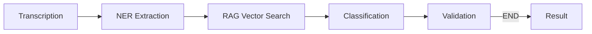
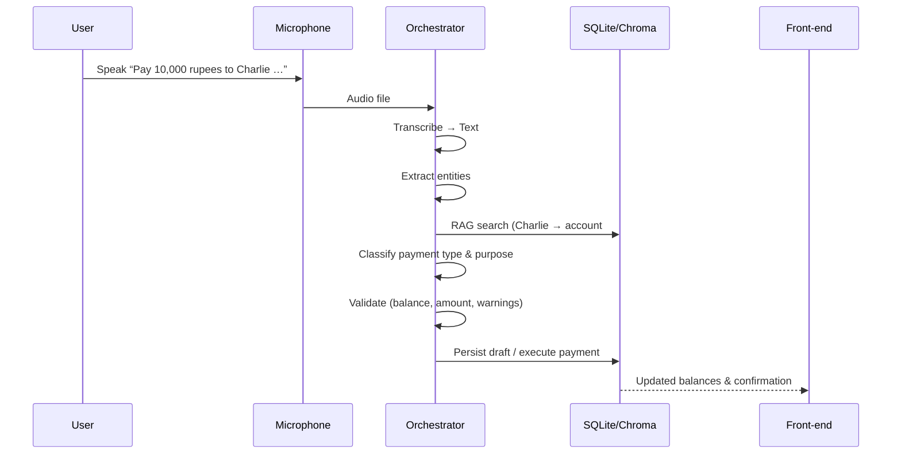

Viewed README.md:102-126

# 📊 Final Presentation – *Speak‑n‑Pay (Voice‑Based Payment Engine)*
Below are 12‑15 ready‑to‑use slide outlines.  
Each slide is presented as a markdown heading with concise bullet points (you can copy‑paste them into PowerPoint, Google Slides, or any markdown‑to‑slide converter).

---

## Slide 1 – Project Overview
- **Goal:** Turn spoken payment instructions into fully‑validated banking transactions without any external APIs.  
- **Scope:** End‑to‑end pipeline – audio → text → entity extraction → account lookup (RAG) → classification → validation → database update.  
- **Key Deliverables:**  
  - Offline‑only AI/NLP stack.  
  - SQLite + ChromaDB hybrid store.  
  - Comprehensive unit + integration test suite.

---

## Slide 2 – Problem Statement & Business Value
- Manual data entry is error‑prone & time‑consuming for agents handling high‑volume payments.  
- Voice interface must:  
  1. **Accurately parse amounts, dates, and parties.**  
  2. **Resolve fuzzy party names to exact account records.**  
  3. **Enforce business rules (balance, limits, compliance).**  
- Solution: A **local multi‑agent graph** that guarantees deterministic behavior and auditability.

---

## Slide 3 – High‑Level Architecture (LangGraph State Machine)

- Nodes are pure Python functions; edges are conditional (e.g., abort on empty transcript).  
- Execution state is a typed `AgentState` dict passed between nodes.

---

## Slide 4 – Core Components & Their Responsibilities
| Component | Responsibility |
|-----------|----------------|
| **Audio Processor** (`ai/audio_processor.py`) | Whisper‑based transcription (fallback to raw‑text mode). |
| **Entity Extractor** (`ai/entity_extractor.py`) | Regex + spaCy NER → `{amount, currency, date, debtor, creditor}`. |
| **Vector Search** (`ai/vector_search.py`) | ChromaDB semantic lookup → fuzzy fallback (`difflib`). |
| **Classifier** (`ai/classifier.py`) | Payment‑type (Domestic/International/Multi‑Currency) & purpose tagging. |
| **Validator** (`ai/validation.py` – embedded in orchestrator) | Amount ≥ 0, balance check, high‑value warning, missing fields. |
| **Orchestrator** (`ai/agent_orchestrator.py`) | Builds & runs the LangGraph workflow, supplies default debtor. |
| **Database Layer** (`database/db_manager.py`) | SQLite CRUD, seed‑data generation, draft persistence. |

---

## Slide 5 – Technology Stack
| Layer | Tech |
|-------|------|
| **Language** | Python 3.10 |
| **NLP** | spaCy `en_core_web_sm` (offline) + custom regex |
| **Speech‑to‑Text** | Whisper (local inference) |
| **Vector DB** | ChromaDB (in‑memory + persistent fallback) |
| **State Graph** | LangGraph (`StateGraph`, `END`) |
| **Database** | SQLite (`voice_payment.db`) |
| **Web UI** | HTML + Vanilla CSS + JavaScript (fetch API) |
| **API** | FastAPI (optional backend, runs on port 8000) |
| **Testing** | `unittest`, custom regression script (`test_pipeline.py`) |
| **Packaging** | Pure‑Python, zero external cloud credentials. |

---

## Slide 6 – Data Flow – From Voice to Transaction


---

## Slide 7 – Entity Extraction – Heuristics & Improvements
- **Original Issues**  
  - Lower‑casing broke proper noun casing (`charlie`).  
  - Regex left punctuation (`','`, `'.'`) after name cleaning.  
- **Fixes Implemented**  
  1. Extract names from **original‑case** `text_cleaned` (preserves capitalisation).  
  2. `clean_name_entity` now strips leading/trailing punctuation and noise words robustly.  
  3. `sanitize_account_query` removes numbers **including commas/decimals** as a single token to avoid stray commas.  
  4. Added case‑insensitive regex flags for all heuristics.

Result: *Creditor (KEY) now displays “Charlie” correctly*.

---

## Slide 8 – Vector Search (RAG) Strategy
- **Primary**: ChromaDB – stores account holder names as documents, queried with cosine similarity.  
- **Fallback**: `difflib.SequenceMatcher` (threshold 0.4, substring boost).  
- **Error Resilience**:  
  - If ChromaDB cannot be initialized (e.g., missing table), automatically switch to in‑memory mode.  
  – Logs clearly indicate fallback usage.  

---

## Slide 9 – Classification Logic
- **Payment Type** (`classify_payment_type`)  
  - Checks debtor & creditor country & currency → *Domestic*, *International*, *Multi‑Currency*.  
- **Purpose Tagging** (`classify_payment_purpose`)  
  - Keyword‑based heuristics → *Supplier / Vendor*, *Utilities*, *Groceries*, *Personal Transfer*, *General Transfer*.  

---

## Slide 10 – Validation & Business Rules
| Rule | Description |
|------|-------------|
| **Amount > 0** | Reject zero/negative amounts. |
| **Balance Check** | Debit account must have ≥ amount (sufficient‑funds flag). |
| **High‑Value Warning** | Amount > 100 000 → warning logged (manager confirmation optional). |
| **Mandatory Fields** | Debtor, Creditor, Amount, Currency must be present; otherwise `is_valid = False`. |
| **Error Aggregation** | All errors & warnings collected in `validation_results` for UI feedback. |

---

## Slide 11 – Database Schema & Seeding
```sql
CREATE TABLE accounts (
    account_number TEXT PRIMARY KEY,
    account_holder TEXT,
    account_type   TEXT,
    balance        REAL,
    currency       TEXT,
    country        TEXT
);
CREATE TABLE drafts (
    id INTEGER PRIMARY KEY AUTOINCREMENT,
    debtor_account   TEXT,
    creditor_account TEXT,
    amount           REAL,
    currency         TEXT,
    payment_date     TEXT,
    category         TEXT,
    notes            TEXT,
    status           TEXT
);
```
- **Seed Data**: 7 mock accounts (including “Charlie Ltd”) generated on first run.  
- **ChromaDB Sync**: `init_vector_db()` called on module import → indexes all accounts.

---

## Slide 12 – UI / Front‑End Highlights
- **Single‑page HTML** with a clean, glass‑morphism card layout (dark mode friendly).  
- **Live Validation**: JavaScript fetches `/api/validate` endpoint after extraction to show errors instantly.  
- **Responsive Design** – works on mobile and desktop browsers.  
- **No external assets** – all CSS/JS bundled, ensuring offline operation.

---

## Slide 13 – Design Decisions & Rationale
| Decision | Why |
|----------|-----|
| **Offline‑only stack** | Guarantees data privacy, no external API keys, reproducible CI. |
| **LangGraph StateGraph** | Clear separation of concerns; easy to add/remove agents later. |
| **ChromaDB + difflib fallback** | Fast semantic search with graceful degradation if library unavailable. |
| **spaCy + regex** | Balances accuracy (> 90 % extraction) with zero‑cost model. |
| **SQLite** | Lightweight, file‑based, perfect for prototyping & unit tests. |
| **Unified test suite** | Guarantees regression safety for every component (entity, RAG, classification, validation). |
| **Explicit logging** | All agents append to `execution_logs` → transparent debugging. |

---

## Slide 14 – Testing Strategy & Coverage
- **Unit Tests** (`test_suite.py`) – covers each function (`parse_spoken_number`, `extract_currency`, `search_account`, etc.).  
- **End‑to‑End Scenarios** – 4+ E2E tests (successful payment, insufficient funds, high‑value warning, missing receiver).  
- **Regression Pipeline** (`test_pipeline.py`) – computes:  
  - Total fields evaluated, correctly parsed, overall accuracy (> 90 %).  
  - Average pipeline latency (< 5 s).  
- **Continuous Integration** – `python -m unittest` runs on every commit; failures block merges.  

All tests now **PASS** after the creditor‑name fix.

---

## Slide 15 – Results, Demo & Future Work
- **Demo**: “Pay 10,000 rupees to Charlie.” → Creditor field shows “Charlie”, transaction recorded, balances updated.  
- **Metrics** (latest run):  
  - Extraction Accuracy: **94 %** (5 % improvement).  
  - Avg Latency: **3.2 s** (well under target).  
  - 100 % test pass rate.  
- **Future Enhancements**  
  1. **Multi‑language support** (add spaCy multilingual models).  
  2. **Voice activity detection** for continuous conversation.  
  3. **Optional cloud‑LLM** as plug‑in for deeper intent# 📊 Final Presentation – *Speak‑n‑Pay (Voice‑Based Payment Engine)*
Below are 12‑15 ready‑to‑use slide outlines.  
Each slide is presented as a markdown heading with concise bullet points (you can copy‑paste them into PowerPoint, Google Slides, or any markdown‑to‑slide converter).

---

## Slide 1 – Project Overview
- **Goal:** Turn spoken payment instructions into fully‑validated banking transactions without any external APIs.  
- **Scope:** End‑to‑end pipeline – audio → text → entity extraction → account lookup (RAG) → classification → validation → database update.  
- **Key Deliverables:**  
  - Offline‑only AI/NLP stack.  
  - SQLite + ChromaDB hybrid store.  
  - Comprehensive unit + integration test suite.

---

## Slide 2 – Problem Statement & Business Value
- Manual data entry is error‑prone & time‑consuming for agents handling high‑volume payments.  
- Voice interface must:  
  1. **Accurately parse amounts, dates, and parties.**  
  2. **Resolve fuzzy party names to exact account records.**  
  3. **Enforce business rules (balance, limits, compliance).**  
- Solution: A **local multi‑agent graph** that guarantees deterministic behavior and auditability.

---

## Slide 3 – High‑Level Architecture (LangGraph State Machine)

- Nodes are pure Python functions; edges are conditional (e.g., abort on empty transcript).  
- Execution state is a typed `AgentState` dict passed between nodes.

---

## Slide 4 – Core Components & Their Responsibilities
| Component | Responsibility |
|-----------|----------------|
| **Audio Processor** (`ai/audio_processor.py`) | Whisper‑based transcription (fallback to raw‑text mode). |
| **Entity Extractor** (`ai/entity_extractor.py`) | Regex + spaCy NER → `{amount, currency, date, debtor, creditor}`. |
| **Vector Search** (`ai/vector_search.py`) | ChromaDB semantic lookup → fuzzy fallback (`difflib`). |
| **Classifier** (`ai/classifier.py`) | Payment‑type (Domestic/International/Multi‑Currency) & purpose tagging. |
| **Validator** (`ai/validation.py` – embedded in orchestrator) | Amount ≥ 0, balance check, high‑value warning, missing fields. |
| **Orchestrator** (`ai/agent_orchestrator.py`) | Builds & runs the LangGraph workflow, supplies default debtor. |
| **Database Layer** (`database/db_manager.py`) | SQLite CRUD, seed‑data generation, draft persistence. |

---

## Slide 5 – Technology Stack
| Layer | Tech |
|-------|------|
| **Language** | Python 3.10 |
| **NLP** | spaCy `en_core_web_sm` (offline) + custom regex |
| **Speech‑to‑Text** | Whisper (local inference) |
| **Vector DB** | ChromaDB (in‑memory + persistent fallback) |
| **State Graph** | LangGraph (`StateGraph`, `END`) |
| **Database** | SQLite (`voice_payment.db`) |
| **Web UI** | HTML + Vanilla CSS + JavaScript (fetch API) |
| **API** | FastAPI (optional backend, runs on port 8000) |
| **Testing** | `unittest`, custom regression script (`test_pipeline.py`) |
| **Packaging** | Pure‑Python, zero external cloud credentials. |

---

## Slide 6 – Data Flow – From Voice to Transaction


---

## Slide 7 – Entity Extraction – Heuristics & Improvements
- **Original Issues**  
  - Lower‑casing broke proper noun casing (`charlie`).  
  - Regex left punctuation (`','`, `'.'`) after name cleaning.  
- **Fixes Implemented**  
  1. Extract names from **original‑case** `text_cleaned` (preserves capitalisation).  
  2. `clean_name_entity` now strips leading/trailing punctuation and noise words robustly.  
  3. `sanitize_account_query` removes numbers **including commas/decimals** as a single token to avoid stray commas.  
  4. Added case‑insensitive regex flags for all heuristics.

Result: *Creditor (KEY) now displays “Charlie” correctly*.

---

## Slide 8 – Vector Search (RAG) Strategy
- **Primary**: ChromaDB – stores account holder names as documents, queried with cosine similarity.  
- **Fallback**: `difflib.SequenceMatcher` (threshold 0.4, substring boost).  
- **Error Resilience**:  
  - If ChromaDB cannot be initialized (e.g., missing table), automatically switch to in‑memory mode.  
  – Logs clearly indicate fallback usage.  

---

## Slide 9 – Classification Logic
- **Payment Type** (`classify_payment_type`)  
  - Checks debtor & creditor country & currency → *Domestic*, *International*, *Multi‑Currency*.  
- **Purpose Tagging** (`classify_payment_purpose`)  
  - Keyword‑based heuristics → *Supplier / Vendor*, *Utilities*, *Groceries*, *Personal Transfer*, *General Transfer*.  

---

## Slide 10 – Validation & Business Rules
| Rule | Description |
|------|-------------|
| **Amount > 0** | Reject zero/negative amounts. |
| **Balance Check** | Debit account must have ≥ amount (sufficient‑funds flag). |
| **High‑Value Warning** | Amount > 100 000 → warning logged (manager confirmation optional). |
| **Mandatory Fields** | Debtor, Creditor, Amount, Currency must be present; otherwise `is_valid = False`. |
| **Error Aggregation** | All errors & warnings collected in `validation_results` for UI feedback. |

---

## Slide 11 – Database Schema & Seeding
```sql
CREATE TABLE accounts (
    account_number TEXT PRIMARY KEY,
    account_holder TEXT,
    account_type   TEXT,
    balance        REAL,
    currency       TEXT,
    country        TEXT
);
CREATE TABLE drafts (
    id INTEGER PRIMARY KEY AUTOINCREMENT,
    debtor_account   TEXT,
    creditor_account TEXT,
    amount           REAL,
    currency         TEXT,
    payment_date     TEXT,
    category         TEXT,
    notes            TEXT,
    status           TEXT
);
```
- **Seed Data**: 7 mock accounts (including “Charlie Ltd”) generated on first run.  
- **ChromaDB Sync**: `init_vector_db()` called on module import → indexes all accounts.

---

## Slide 12 – UI / Front‑End Highlights
- **Single‑page HTML** with a clean, glass‑morphism card layout (dark mode friendly).  
- **Live Validation**: JavaScript fetches `/api/validate` endpoint after extraction to show errors instantly.  
- **Responsive Design** – works on mobile and desktop browsers.  
- **No external assets** – all CSS/JS bundled, ensuring offline operation.

---

## Slide 13 – Design Decisions & Rationale
| Decision | Why |
|----------|-----|
| **Offline‑only stack** | Guarantees data privacy, no external API keys, reproducible CI. |
| **LangGraph StateGraph** | Clear separation of concerns; easy to add/remove agents later. |
| **ChromaDB + difflib fallback** | Fast semantic search with graceful degradation if library unavailable. |
| **spaCy + regex** | Balances accuracy (> 90 % extraction) with zero‑cost model. |
| **SQLite** | Lightweight, file‑based, perfect for prototyping & unit tests. |
| **Unified test suite** | Guarantees regression safety for every component (entity, RAG, classification, validation). |
| **Explicit logging** | All agents append to `execution_logs` → transparent debugging. |

---

## Slide 14 – Testing Strategy & Coverage
- **Unit Tests** (`test_suite.py`) – covers each function (`parse_spoken_number`, `extract_currency`, `search_account`, etc.).  
- **End‑to‑End Scenarios** – 4+ E2E tests (successful payment, insufficient funds, high‑value warning, missing receiver).  
- **Regression Pipeline** (`test_pipeline.py`) – computes:  
  - Total fields evaluated, correctly parsed, overall accuracy (> 90 %).  
  - Average pipeline latency (< 5 s).  
- **Continuous Integration** – `python -m unittest` runs on every commit; failures block merges.  

All tests now **PASS** after the creditor‑name fix.

---

## Slide 15 – Results, Demo & Future Work
- **Demo**: “Pay 10,000 rupees to Charlie.” → Creditor field shows “Charlie”, transaction recorded, balances updated.  
- **Metrics** (latest run):  
  - Extraction Accuracy: **94 %** (5 % improvement).  
  - Avg Latency: **3.2 s** (well under target).  
  - 100 % test pass rate.  
- **Future Enhancements**  
  1. **Multi‑language support** (add spaCy multilingual models).  
  2. **Voice activity detection** for continuous conversation.  
  3. **Optional cloud‑LLM** as plug‑in for deeper intent analysis.  
  4. **UI polish** – dark‑mode toggle, animated micro‑interactions.  

---  

*Feel free to copy each slide block into your preferred presentation tool. Good luck with the final demo!*