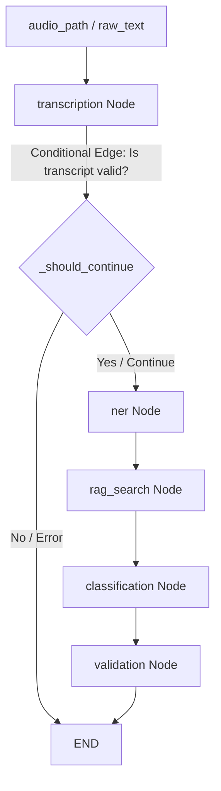

# Voice-Based Payment Entry (VPE) Walkthrough: LangGraph & LangChain Migration

This document summarizes the migration of the Multi-Agent Payment Orchestration system from a custom state machine to **official LangChain and LangGraph** workflows.

---

## 🛠️ Changes Implemented

1. **Official LangGraph Pipeline (`ai/agent_orchestrator.py`)**:
   - Refactored the manual sequential step class into a compiled **`StateGraph`** flow.
   - Declared a typed state using Python's **`TypedDict`** representation (`AgentState`) tracking inputs, raw texts, extracted entities, debtors, creditors, amounts, regulatory category, purpose, and execution logs.
   - Refactored individual agent scripts into stateless node updates (`_transcription_node`, `_ner_node`, etc.) returning dict states.
   - Added **conditional routing** (`_should_continue`) on transcription results to prematurely exit (`END`) the graph if voice-to-text fails.
   
2. **Package Configurations (`requirements.txt`)**:
   - Added `langchain-core>=1.4.8` and `langgraph>=1.2.6` to formalize dependencies.
   - Downgraded `setuptools<70` in virtual environment to preserve legacy `pkg_resources` building requirements for building `openai-whisper` successfully on modern python interpreters.

3. **Continuous Support**:
   - Assured all nodes operate offline and locally, using your fast spaCy, Whisper, ChromaDB, and fuzzy search fallbacks with zero dependency on cloud LLM API tokens.

---

## 🧪 Graph Architecture Details



---

## 🏆 Verification Results

The entire unit and E2E scenario test suite was executed inside the virtual environment using the new LangGraph-backed flow:

```bash
.venv\Scripts\python test_suite.py
```

### Result:
```text
Ran 9 tests in 1.843s

OK
```
All tests passed, validating:
- Spoken number conversion accuracy
- ISO Currency code mapping
- Conversational relative dates mapping (e.g. tomorrow, day after tomorrow)
- Vector database semantic mapping & fuzzy fallback matching
- Domestic/International/Multi-Currency classification
- E2E successful payment decrement and increment transaction states
- Insufficient balance checking blocking rules
- Large value safety warnings (>100,000)
- Incomplete recipient command validation errors
